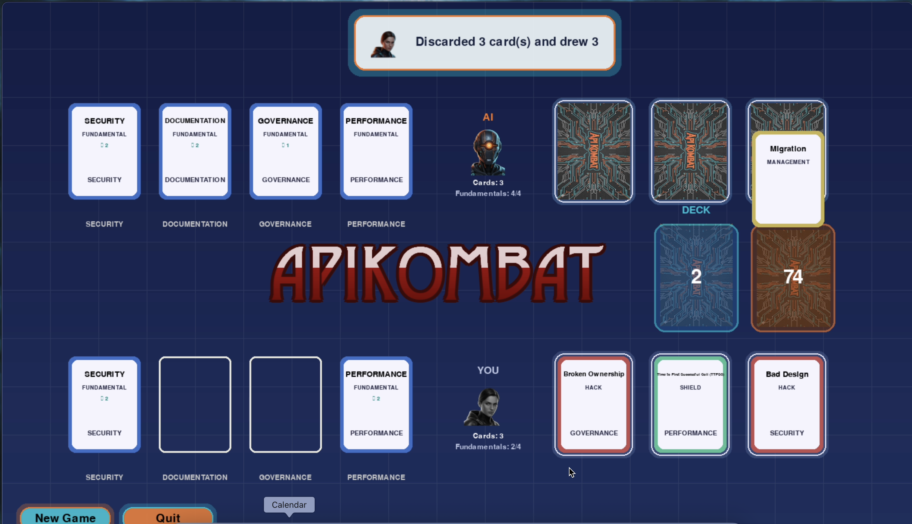

# APIKOMBAT Documentation Hub

This directory groups the key documents you need to understand the APIKOMBAT tournament, play the card game, and submit your APIs for scoring.

  

## Quick navigation
- [`official_rules.md`](./official_rules.md) – Official tournament rules: eligibility, evaluation phases, match flow.
- [`how_to_play.md`](./how_to_play.md) – Complete gameplay guide covering objectives, card types, and turn structure.
- [`cards.md`](./cards.md) – Inventory of every card, grouped by type and color with icon and asset references.
- [`zip_file.md`](./zip_file.md) – Step-by-step instructions (in Spanish) to assemble the `.zip` bundle for the API Scoring validator.
- [`scoring.md`](./scoring.md) – Reference table of scoring rules; explore further recommendations on <a href="https://www.apicurios.com/recommendations" target="_blank" rel="noopener">Apicurios</a>.

## If you are competing in the tournament
1. Start with [`official_rules.md`](./official_rules.md) to confirm team composition, submission format, and how the jury awards advantage cards.
2. Review `how_to_play.md` and `cards.md` to master the in-game mechanics before the knockout stages.
3. Prepare your deliverable with the help of `zip_file.md`, ensuring both the `.zip` structure and documentation meet the scoring requirements.

## If you are building or validating APIs
1. Follow `zip_file.md` to package contracts and Markdown docs so the web validator accepts your bundle.
2. Use `scoring.md` as a checklist to pre-validate OpenAPI definitions and Markdown files before uploading.

---

Keep these documents aligned with rule updates or deck changes so competitors and reviewers always have the latest guidance.
